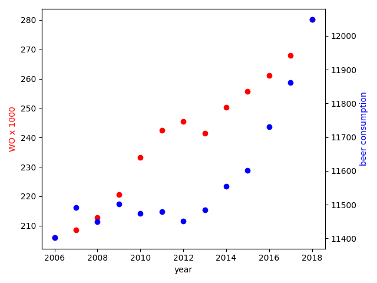

student ID: 2907863

* *Fantastic yeasts and where to find them: the hidden diversity of dimorphic fungal pathogens*, MCC Van Dyke et al., 2019
* *An analysis of the forces required to drag sheep over various surfaces*, JT Harvey et al., 2002
* *The neurocognitive effects of alcohol on adolescents and college students*, DW Zeigler et al., 2005

Though these variables are plotted with different scales, we do see that they both mostly share a vaguely linear growth. 